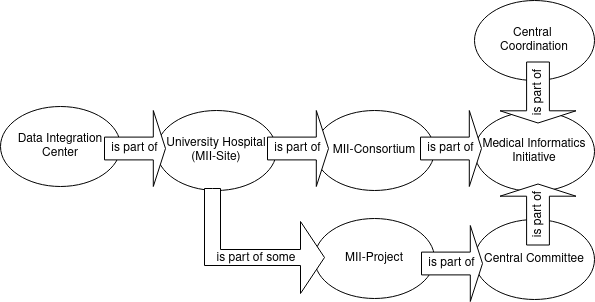

# MII Quickstart Guide 
You just started working in a medical data integration center (DIC). Congratulations - you are part of an exciting network encompassing all 36 university hospitals in Germany! :smiley:

## Organisational Structure of the MII

The main organisational components are 
- **Data Integration Center**: The DIC is typically a facility within a hospital closely connected to clinical data centers, ensuring a tight integration with healthcare systems; its responsibilities include collecting data from various source systems, consolidating and processing this data, ensuring data quality and data protection, and making the processed data available for medical research while also facilitating the integration of research findings into patient care.
- **University Hospital**: *The medical centres involved are visualised in the map in this [file](./MII_Information.md)*
- **MII Consortium**: The MII consists of four consortia, which work at different locations and on different medical topics or clinical use cases.
- **Central Coordination**: The Central Coordination is the coordinating office responsible for organizing and supporting the overarching collaboration within the Medical Informatics Initiative, operated by "Technologie- und Methodenplattform für die vernetzte medizinische Forschung e.V." in Berlin.
- **MII Project**: There are 3 different categories: Module 2b projects, Module 3 projects and Digitale FortschrittHubs Gesundheit. In this guide, the projects are introduced briefly.
- **Central Committee**: The central committee of the Medical Informatics Initiative, oversees and guides the implementation of the funding concept by coordinating collaboration, making decisions on working groups and topics, and providing recommendations on various aspects of the initiative, including data usage and standards.
- **The Medical Informatics Initiative** in total

Further Information to the MII are in this [file](./README.md)

## Access and account setup
| Description | Link | Contact |
| -------- | -------- | -------- |
| MII Sharepoint | https://tmfev.sharepoint.com/ | office@medizininformatik-initiative.de
| Deutsches Forschungsdatenportal für Gesundheit | https://www.forschen-fuer-gesundheit.de/register.php | /

## Learning and education ressources
### Ethical-legal framework and organisation of a DIC
| Name | Description | Type | Link | Language |
| --- | --- | :---: | --- | --- |
| Die 3 Säulen eines DIZ  | Organization, technology and ethical-legal framework of a DIC | text-nugget | [baseTraCE-document](https://tmfev.sharepoint.com/:b:/r/sites/tmf/mi-i/Modul2Projekte/baseTraCE/Lernmaterialien/baseTraCE/Text-Nuggets/Die-drei-S%C3%A4ulen-eines-DIZ.pdf?csf=1&web=1&e=z4jUt7) | German
| Ethisch-rechtlicher Rahmen eines DIZ | the ethical-legal framework of a DIC | text-nugget | comming soon | German
| DIZ-Organisation | organisation of a DIC | test-nugget | coming soon | German

### MII architectural concept - services and processes
| Name | Description | Type | Link | Language |
| --- | --- | :---: | --- | --- |
| Die Komponenten eines DIZ | Components of a data integration center for harmonized data storage and provision | text-nugget | comming soon | German
| MII Gesamtarchitektur | MII data sharing architecture of the task force comprehensive interfaces | website | https://github.com/medizininformatik-initiative/mii-architecture/wiki | German
| Die Prozesslandschaft eines DIZ | typical process landscape of a data integration center with data processing as the core process | text-nugget | comming soon | German
| DIC Services | services of a core DIC | text-nugget | comming soon | German

### Design and development of a DIC
| Name | Description | Type | Link | Language |
| --- | --- | :---: | --- | --- |
| Overview article | Data integration centers—from a concept in the Medical Informatics Initiative to its local implementation in the Network of University Medicine | paper | [Bundesgesundheistblatt](https://rdcu.be/dIF0O) |German
| DIC establishment and onboarding to the MII and the FDPG | DIZ-Onboarding-Masterdokument | document | noch nicht freigegeben | German
| Establishment of a data integration center | necessary framework conditions and milestones for the establishment of a DIC | video |[MD-Kolloquium](https://sites.google.com/master-bids.de/miracum-difuture-kolloquium/archiv/2023/2023-06-20-das-diz-am-ukr-stand-des-aufbaus-und-spezifit%C3%A4ten) | German
| Establishment of a data integration center | Organization and structures of a non-university DIC | video | [MD-Kolloquium](https://sites.google.com/master-bids.de/miracum-difuture-kolloquium/archiv/2023/2023-07-04-das-diz-am-klinikum-chemnitz-motivation-konzeption-mehrwert) | German

### Data sets in medical informatics
| Name | Description | Type | Link | Language |
| --- | --- | :---: | --- | --- |
| MII Core data set | Short introduction to MII-CDS | video | [video introduction to MII-CDS](https://www.youtube.com/watch?v=aZa4to8Hk9E) | German
| MII Core data set | Introduction to MII-CDS | lecture recording | [lecture recording to MII-CDS](https://sites.google.com/master-bids.de/miracum-difuture-kolloquium/archiv/2023/2023-09-26-der-mii-kerndatensatz-und-seine-erweiterungsmodule) | German
| Basic modules | Basic modules of the MII core data set described by MII Working group Interoperability | description | [Basic modules of the MII core data set](https://www.medizininformatik-initiative.de/en/basic-modules-mii-core-data-set) | English and German

### Data standards in medical informatics
#### FHIR
| Description | Link | Language |
| -------- | -------- | -------- |
| FHIR (HL7 Fundamentals Course) | https://www.hl7.org/training/HL7-fundamentals.cfm?ref=nav | English
| FHIR Kindling (CRUD operations) | https://sites.google.com/master-bids.de/miracum-difuture-kolloquium/archiv/2022/2022-09-06-fhir-kindling-python-fhir-library | German with english slides
| FHIR basics | https://sites.google.com/master-bids.de/miracum-difuture-kolloquium/archiv/2022/2022-03-29-grundprinzipien-von-fhir | German
| FHIR and MII core data set | https://sites.google.com/master-bids.de/miracum-difuture-kolloquium/archiv/2022/2022-04-05-fhir-search-und-der-mii-kerndatensatz | German
| FHIR interface between intensive care documentation system and data integration centre | https://sites.google.com/master-bids.de/miracum-difuture-kolloquium/archiv/2021/2021-08-03-fhir-schnittstelle-zwischen-intensivdokumentationssystem-und-dat | German
| Introduction to HL7 FHIR by Simone Heckmann (SMITH-Winterworkshop 2020)| https://player.vimeo.com/video/530260312 | German

#### LOINC
| Description | Link | Language |
| -------- | -------- | -------- |
| LOINC (Video Tutorials) | https://loinc.org/videos/ | English

#### SNOMED CT
| Description | Link | Language |
| -------- | -------- | -------- |
| SNOMED CT (E-Learning Platform) | https://elearning.ihtsdotools.org/ | English

### Technologies that are agreed to be used throughout all DICs
| Description | Link | Language |
| -------- | -------- | -------- |
| Docker |  | 
| DSF |  |
| ... |  |

### Concepts
| Description | Link | Language |
| -------- | -------- | -------- |
| FAIR Principles |  |
| Pseudonymisation |  |
| ... |  |

### Additional material
| Description | Link | Language |
| -------- | -------- | -------- |

We hope you found the information you are looking for. If not, please open an issue and give feedback. 
